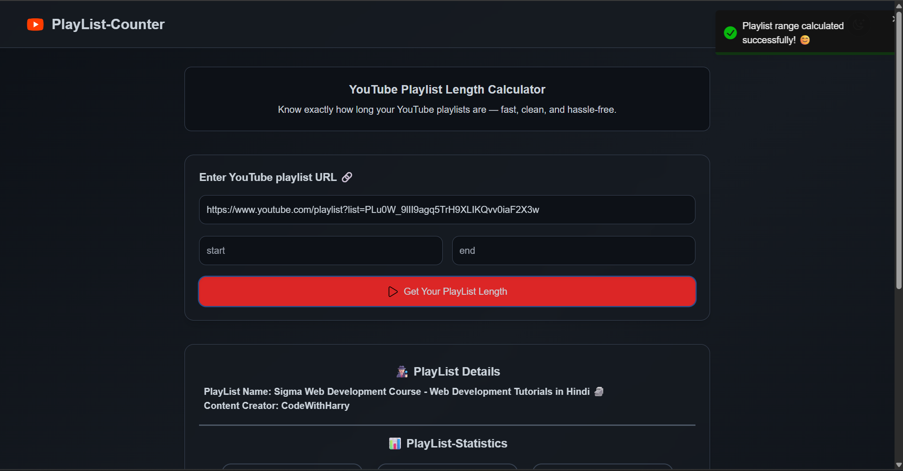
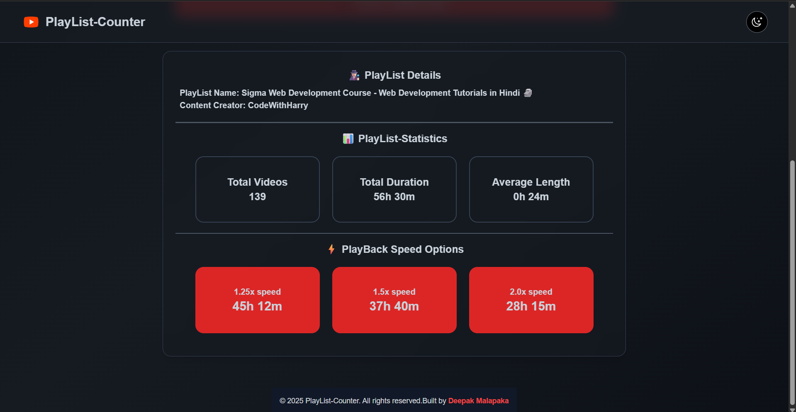
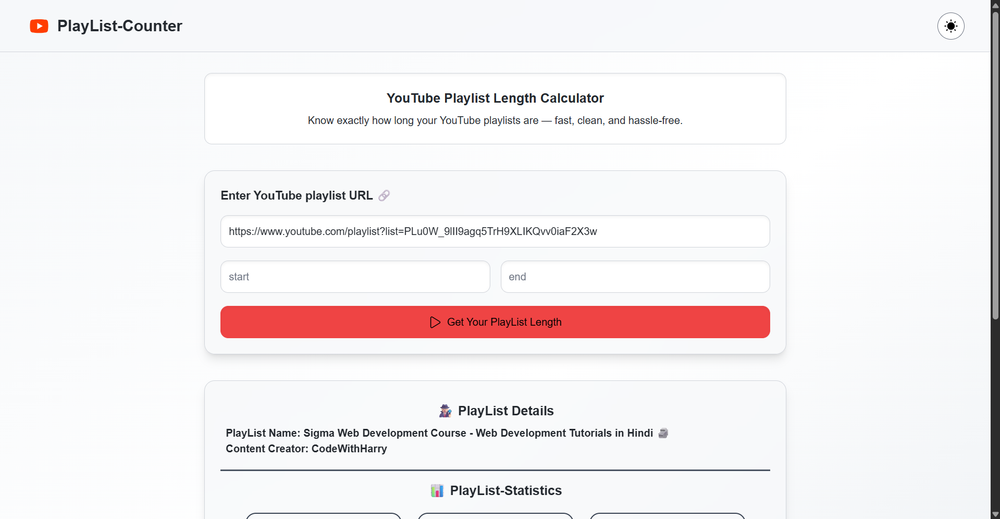

# 📺 PlayList-Counter  

A **YouTube Playlist Length Calculator** — know exactly how long your playlists are in hours, minutes, and seconds.  
Fast ⚡, clean 🎨, and hassle-free ✅.  

👉 **Live Demo**: [PlayList-Counter](https://playlist-counter.netlify.app/)  

---

## 🚀 Features  

- 🔗 Enter any **YouTube playlist URL** and get instant results  
- 🎥 **Total number of videos** in the playlist  
- ⏳ **Total duration** of the playlist (HH:MM:SS)  
- 📊 **Average video length**  
- ⚡ **Playback speed options** (1.25x, 1.5x, 2x)  
- 📌 Works for **large playlists** (more than 50 videos) with pagination (`nextPageToken`)  
- 🌙 **Dark & Light mode** support  
- 🎨 **Responsive UI** built with React + TailwindCSS  

---

## 📸 Preview  

### 🔹 Home Page (Dark Mode)  
  

### 🔹 Playlist Results (Dark Mode)  
  

### 🔹 Home Page (Light Mode)  
  

---

## 🛠️ Tech Stack  

- ⚛️ **React.js**  
- 🎨 **TailwindCSS**  
- 🌐 **Axios** for API requests  
- 🔔 **React-Toastify** for notifications  
- 🎥 **YouTube Data API v3**  

---
📜 License
This project is licensed under the MIT License.

👨‍💻 Author
Built with ❤️ by Deepak Malapaka